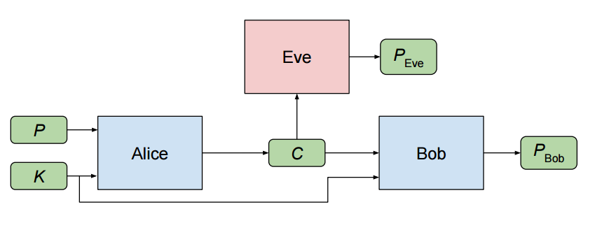

# Adversarial Neural Cryptography using TensorFlow

A Tensorflow Flow implementation of Google Brain's paper ([Learning to Protect Communications with Adversarial Neural Cryptography.](https://arxiv.org/pdf/1610.06918v1.pdf))

Two Neural Networks, Alice and Bob learn to communicate secretly with each other, in presence of an adversary Eve.

## Pre-requisites

* TensorFlow 
* Keras
* matplotlib
* Numpy

## Thanks

* DCGAN [implementation](https://www.tensorflow.org/tutorials/generative/dcgan) in TensorFlow. 
